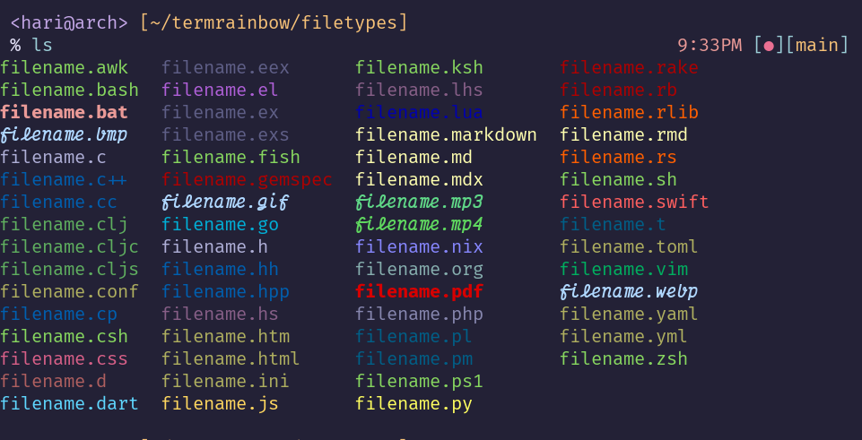
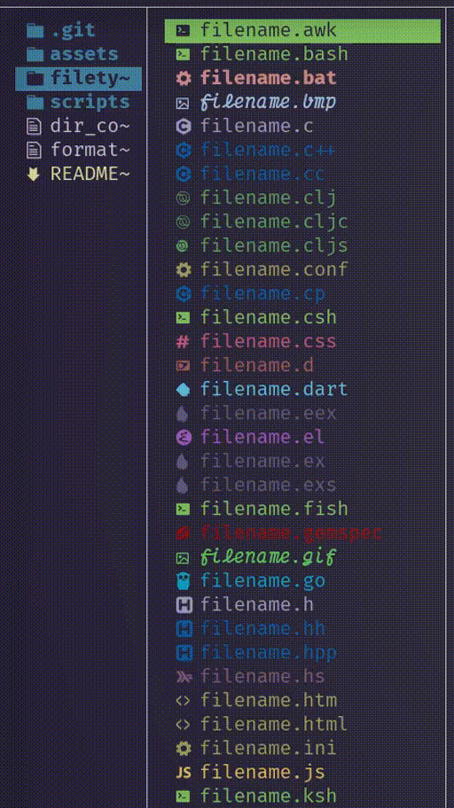

<div align="center">

# TermRainbow


Color utilitites for 256-color Terminals

</div>

## Intro

Most of the current terminals support 256 colours. TermRainbow aims to provide visual formatting for various filetypes, provide a bunch of scripts to handle 256 colours so that your terminal output looks complete in terms of various colours in unix based systems.


The colours include output which is supported by LS_COLORS such as `ls`, as well as for terminal file managers supporting LS_COLORS such as `lf`.




TermRainbow also works with true color terminals, however since it uses 256 colours, the availability of various colours are limited. It does not have any dependencies(dircolors or alternatives in non GNU systems is the only requirement), so it works without breaking.


## Quickstart

Make sure you have [dircolors](https://man7.org/linux/man-pages/man1/dircolors.1.html) installed, although it would be installed by default on linux systems as part of coreutils.

The main file of focus here is the `dir_colors` file, which contains all the definitions for various filetypes. Simply copy the file to the desired location, and source the file. You can add this line to your shell rc file

```
test -r path/file && eval $(dircolors path/file)
```
replacing `path/file` with the name of your file with its corresponding path.

## Scripts

Various utility scripts are provided to help along the way if necessary...

### createfile.sh

Create files with different file formats as specified in the formats.txt file

### hexconvert.py

Utility script to convert hex colours to the nearest xterm 256 colour, in case you want to tweak the entries
(Credits to [chrisdiana](https://github.com/chrisdiana) who credits [Micah Elliott](http://MicahElliott.com))

# Principles

Since this project tend to get highly opinionated, a set of specifications or guidlines will be set up so that future ideas and issues can be dealt with. There could always be a lot of incremental changes that can make the experience better. Some basic specifications are as follows:

- Many of the file formats are of similar type (eg: image formats, video formats, document formats etc..) so they are grouped together.
- The filetypes of common file formats are usually made bold and/or italic to differentiate with other widely used file formats
- The rest of the file formats are usually provided with colours from various entities associated with it(eg: colours from the icons). Sometimes the specific colour is not available in the 256 colour palette so the nearest colour is used.


# Contributing

There are a bunch of limitations while using TermRainbow, hence all kinds of suggestions and feedbacks are welcome. Raise an issue for whatever reason related to making the experience better.
In case there are better colour suggestions backed by sensible reasons, I am more than willing to change the formatting as required.

In case you have a filetype to include, create a pull request with the screenshots of the appropriate colours used. Try to make the colours related to the filetype in some way. Also limit the use of filetypes if its not usually used (for eg: fortran file extensions, although can be created, need not be included since people who use fortran may not use TermRainbow in their system; this need not always be the case and can be included in case there are users requiring fortran extension highlighting). 

# Alternatives

- [Vivid](https://github.com/sharkdp/vivid) (A themeable LS_COLORS generator with a rich filetype datebase)
